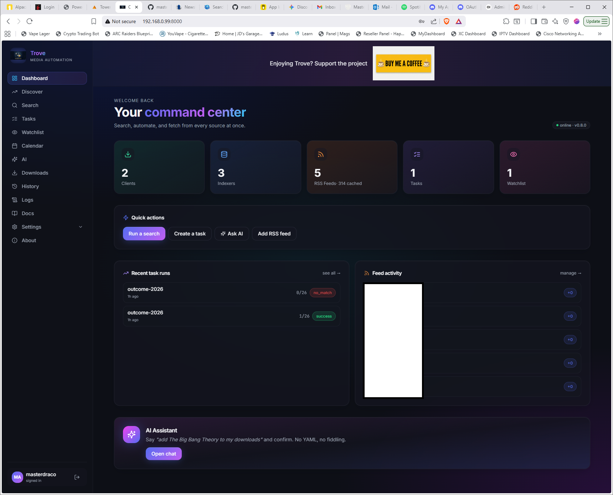
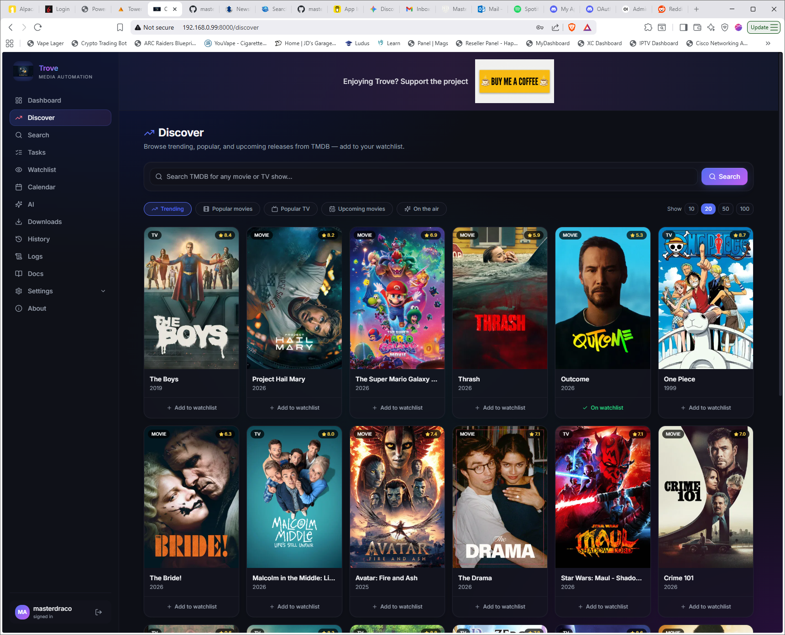
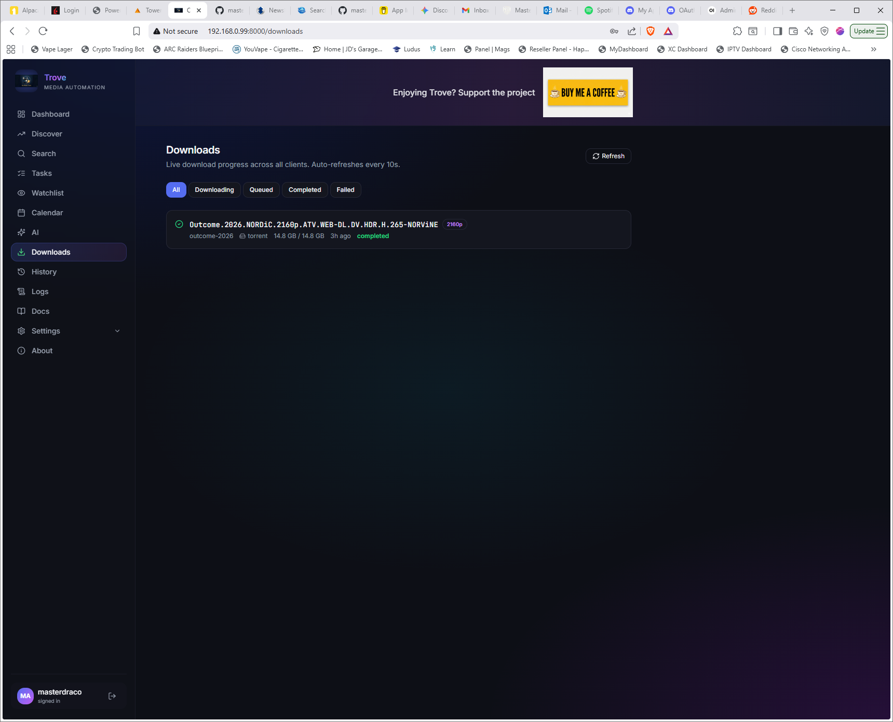
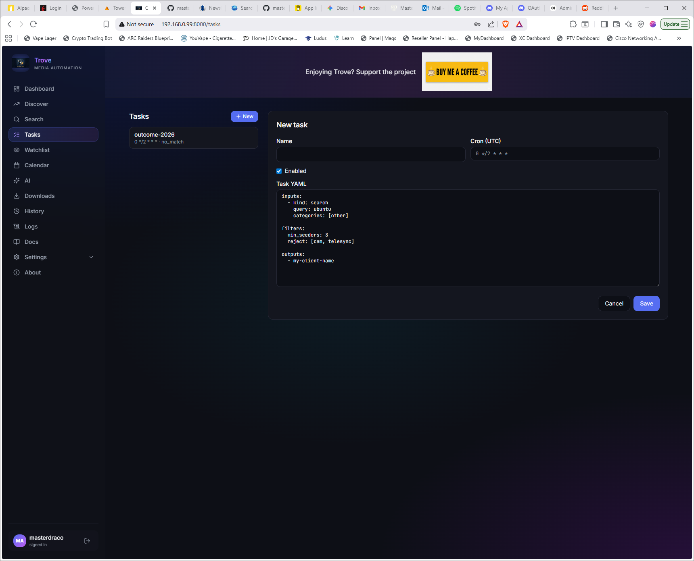
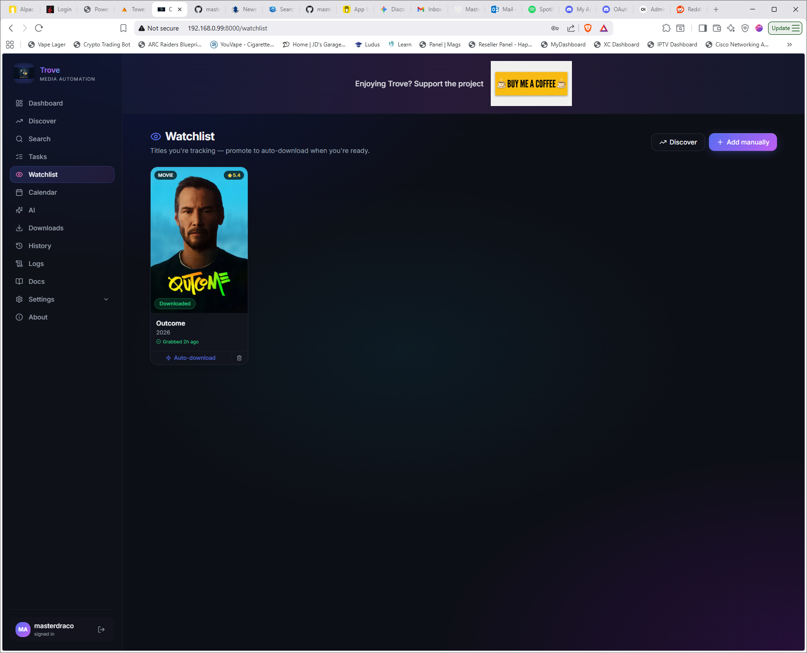
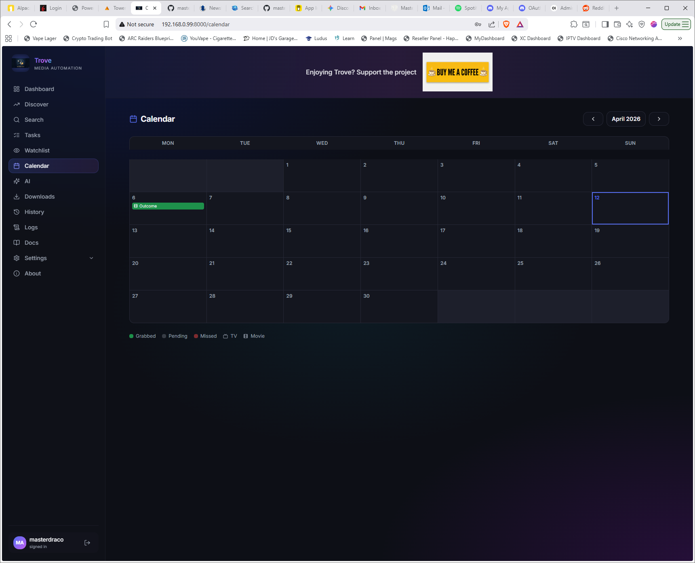
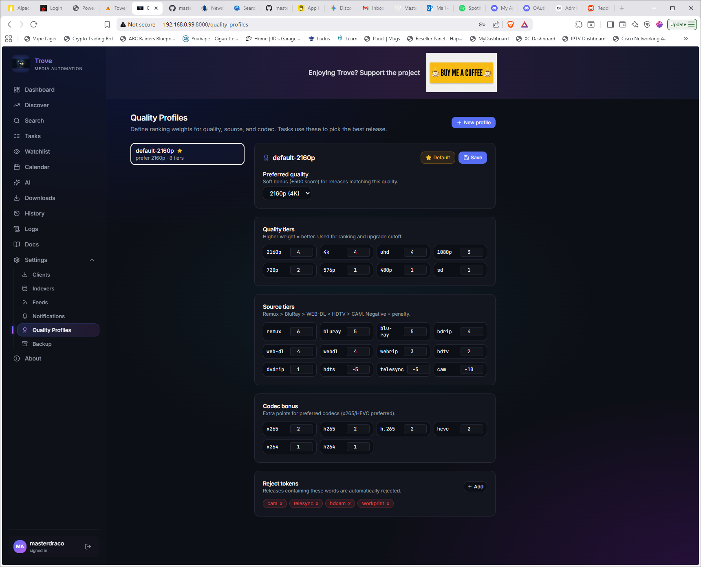
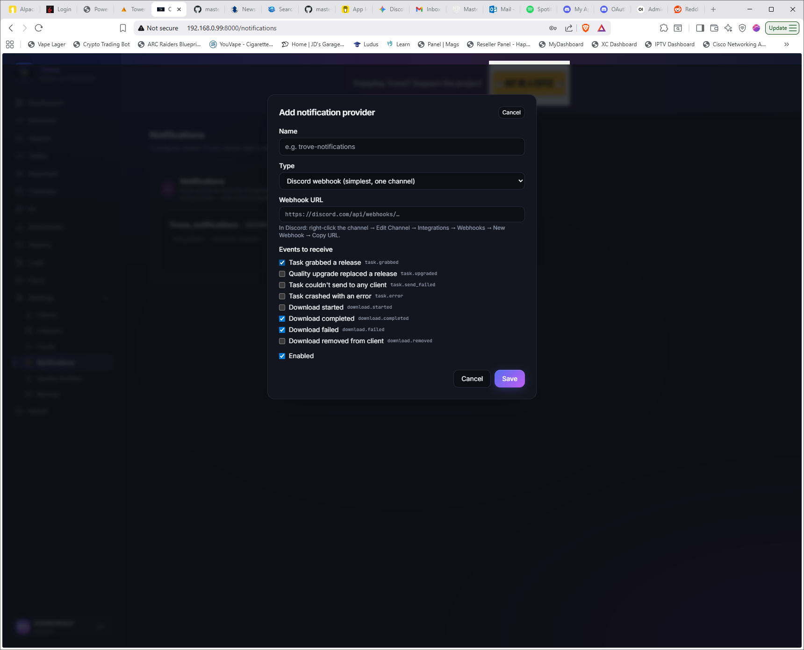
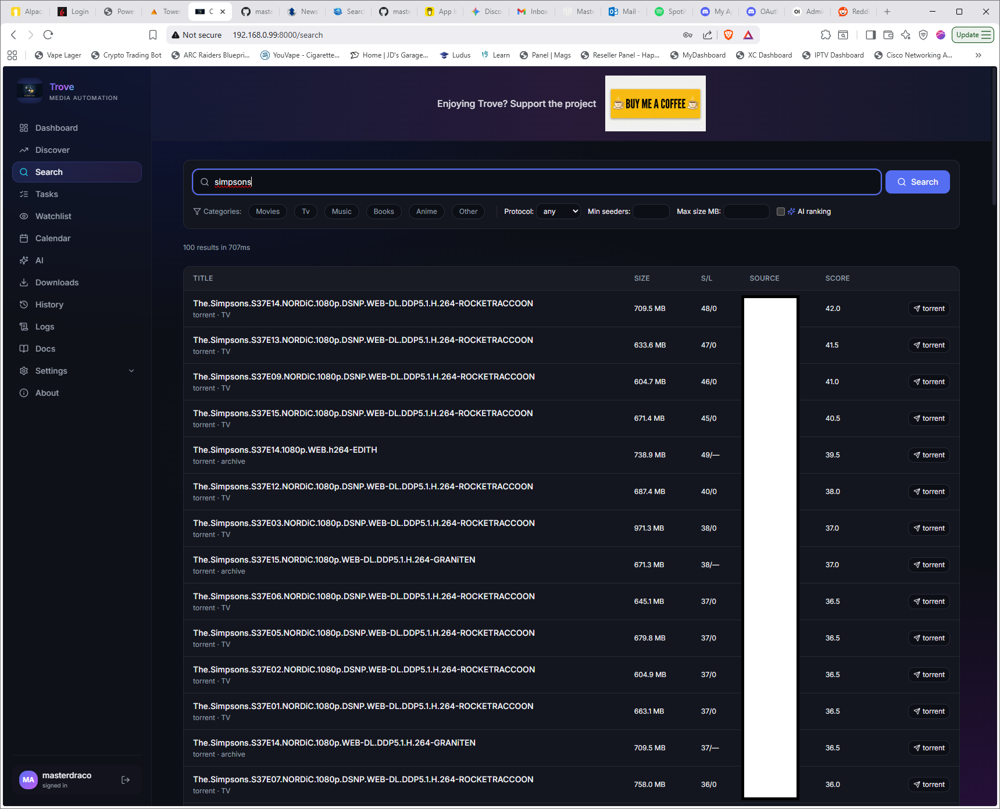
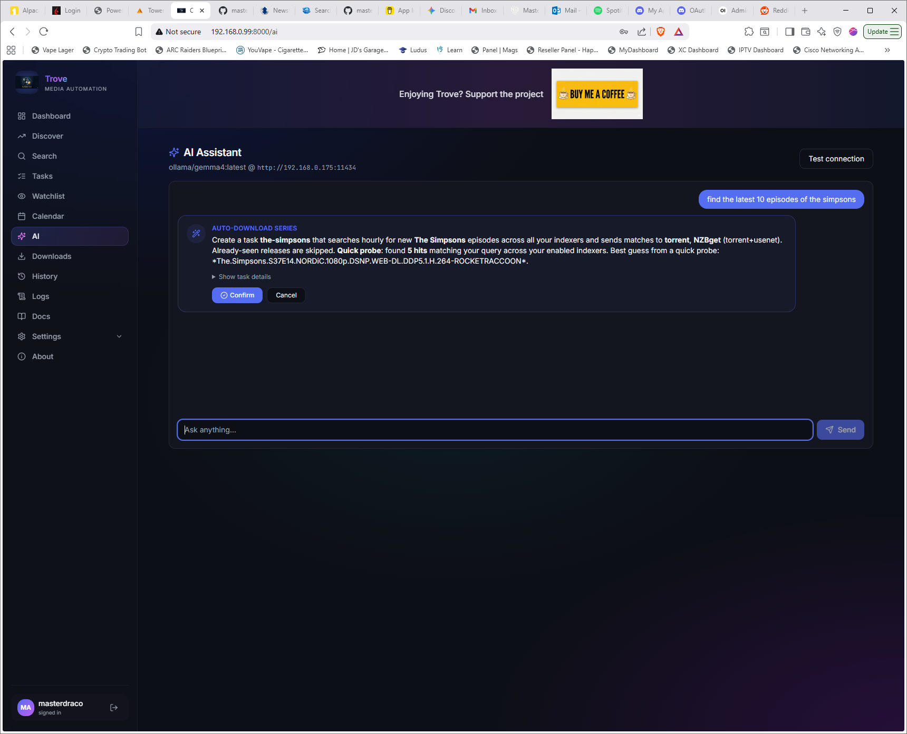

<p align="center">
  
</p>

<p align="center">
  <strong>Self-hosted media automation hub</strong><br>
  Search across multiple indexers, automate downloads, track quality upgrades — all from a single UI.
</p>

<p align="center">
  <a href="#features">Features</a> &middot;
  <a href="#screenshots">Screenshots</a> &middot;
  <a href="#quick-start-docker">Quick Start</a> &middot;
  <a href="#development">Development</a> &middot;
  <a href="#support">Support</a>
</p>

---

## Screenshots

<details>
<summary><strong>Click to expand screenshots</strong></summary>

| | |
|---|---|
|  |  |
| Dashboard — stats and recent activity | Discover — browse TMDB trending & upcoming |
|  |  |
| Downloads — live progress bars | Tasks — YAML config with dry run |
|  |  |
| Watchlist — track movies & series | Calendar — Sonarr-style month grid |
|  |  |
| Quality Profiles — custom ranking weights | Notifications — Discord, Telegram, ntfy |
|  |  |
| Search — multi-indexer results | AI — natural language task creation |

</details>

---

## Features

### Search & Indexers
- **Multi-indexer search** — Newznab, Torznab, UNIT3D (Nordicbytes), RarTracker (Superbits), Cardigann-compatible
- **RSS feed polling** with caching and search-within-cache
- **Torznab export** — use Trove as the indexer for Sonarr, Radarr, Lidarr
- **Indexer health dashboard** — 24h sparkline, success rate, latency per indexer

### Download Clients
- **4 clients supported**: Transmission, Deluge, SABnzbd, NZBGet
- **Live download monitoring** — progress bars, ETA, size, status (queued/downloading/completed/failed)
- **Server-side torrent prefetch** — handles private tracker cookie auth transparently

### Automation
- **Task engine** — YAML-configured input/filter/output pipelines with cron scheduling
- **Watchlist** — add movies & TV series, auto-promote to download tasks
- **TV backfill** — per-season iteration with smart empty-season cutoff
- **Quality upgrade path** — auto-replace grabs with better quality until target tier is reached
- **Quality profiles** — custom ranking weights for quality, source, codec, with reject tokens

### Discovery & Calendar
- **TMDB integration** — browse trending, popular, upcoming releases with poster grid
- **Sonarr-style calendar** — month grid showing release dates with grabbed/pending/missed status
- **Per-page selector** — view 10, 20, 50, or 100 results at once

### Notifications
- **5 provider types**: Discord (webhook + bot), Telegram, ntfy, generic webhook
- **8 event types**: grabbed, upgraded, send failed, error, download started/completed/failed/removed

### AI Assistant
- **Local LLM** via Ollama + litellm — no cloud dependency
- **Natural language task creation** — describe what you want, AI builds the task config
- **Protocol-aware** — probes your indexers to pick the right protocol

### System
- **One-click self-update** from GitHub
- **Backup & restore** — full database + session secret in a single ZIP
- **Guided onboarding wizard** — step-by-step setup for first-time users
- **Built-in documentation** with feature walkthroughs

---

## Quick Start (Docker)

### Prerequisites

- **Docker** and **Docker Compose** (v2)
- **Docker Buildx** — required to build the image. Most Docker Desktop installs include it, but on Linux servers you may need to install it separately:
  ```bash
  sudo apt-get install docker-buildx-plugin
  ```

### Install

```bash
git clone https://github.com/masterdraco/Trove.git
cd Trove
docker-compose up -d
```

Open **http://localhost:8000** and complete the setup wizard.

> **Docker permission denied?** Add your user to the docker group:
> ```bash
> sudo usermod -aG docker $USER && newgrp docker
> ```

### LAN Access

Docker publishes port 8000 on all interfaces by default. For remote access, put a reverse proxy (Caddy, Traefik, nginx) with HTTPS in front.

To lock to a single interface:
```yaml
# docker-compose.yml
ports:
  - "192.168.0.50:8000:8000"
```

### Data

All persistent data lives in `./config/`:
- `trove.db` — SQLite database
- `session.secret` — encryption key for stored credentials

Back up both files, or use the built-in **Backup & Restore** in Settings.

---

## Development

**Backend** (Python 3.12+, FastAPI):

```bash
cd backend
uv sync
uv run alembic upgrade head
uv run uvicorn trove.main:app --reload
```

**Frontend** (SvelteKit 5, TypeScript):

```bash
cd web
pnpm install
pnpm dev
```

The Svelte dev server proxies `/api/*` to `http://localhost:8000`.

---

## Tech Stack

| Layer | Tech |
|-------|------|
| Backend | Python 3.12, FastAPI, SQLModel, Alembic, APScheduler |
| Frontend | SvelteKit 5, TypeScript, Tailwind CSS, Lucide icons |
| Database | SQLite (WAL mode, busy_timeout) |
| AI | litellm + Ollama (optional) |
| Container | Docker, single image (~200MB) |

---

## Support

If Trove saves you time, consider supporting the project:

<a href="https://www.buymeacoffee.com/MasterDraco" target="_blank">
  
</a>

---

## License

GPL-3.0-or-later. See [LICENSE](LICENSE).
